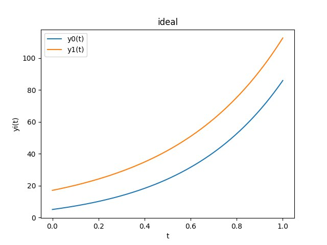
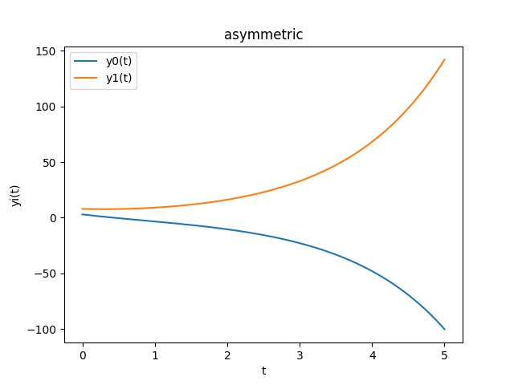
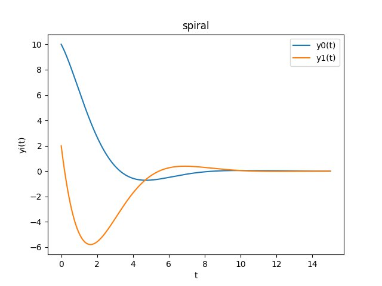
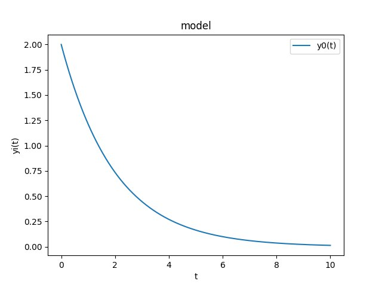
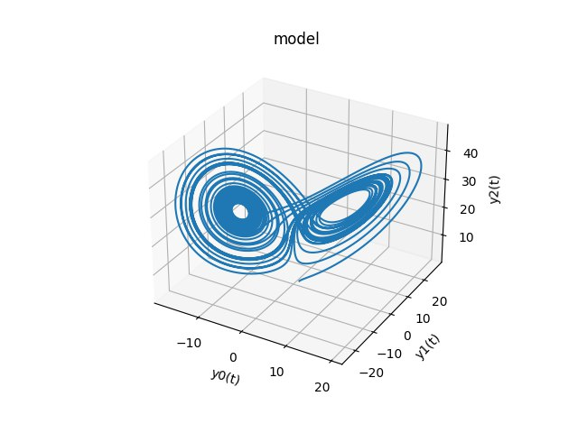
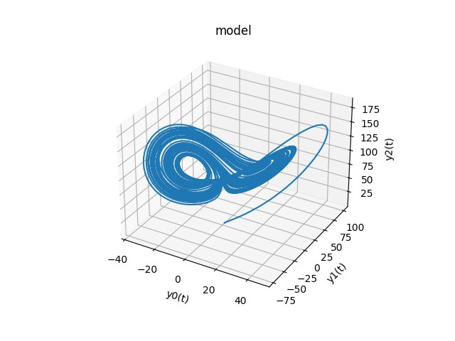

### Sergio Pérez Pantoja
### C-311

 

# Informe técnico: Ecuaciones Diferenciales BOTdinarias

## 1 Introducción
Este artículo tiene como objetivo explicar el funcionamiento del bot de Telegram [ODEbot](https://t.me/botdinaryDE_bot) y su implementación en Python. El objetivo es proveer de una aplicación computacional que permita resolver sistemas de ecuaciones diferenciales ordinarias con condiciones iniciales de forma interactiva y sencilla, sin necesidad de conocimientos previos de programación, brindando una interfaz de usuario basada en el servicio de mensajería instantánea Telegram. Esta aplicación permite al usuario plantear un sistema de ecuaciones diferenciales, parámetros constantes del sistema, condiciones iniciales, el intervalo de integración y la cantidad de puntos a calcular. El bot resuelve el sistema de ecuaciones y devuelve una gráfica con la solución del sistema. Se le permite al usuario editar aspectos de su modelo sin la necesidad de rehacerlo desde el inicio. Contiene un modo tutorial donde se plantea un sistema de dos ecuaciones diferenciales representando una relación de pareja con varios escenarios posibles, como manera de introducir al usuario a las capacidades de la aplicación. El programa usa la librería de Python SciPy [1] para resolver el sistema de ecuaciones diferenciales, específicamente el método [solve_ivp](https://docs.scipy.org/doc/scipy/reference/generated/scipy.integrate.solve_ivp.html), y la librería Matplotlib [2] para graficar la solución del sistema. Para la interfaz de usuario se usa la librería de Python [python-telegram-bot](https://docs.python-telegram-bot.org/en/v20.0b0/).

Lo que sigue en este documento se encuentra organizado de la siguiente forma. Primero, se explica las tecnologías usadas y la razón de su elección en la [sección 2](#2-tecnologías). En la [sección 3](#3-problemas-del-corazón) se explican los modelos de relaciones de pareja mencionados anteriormente. En la [sección 4](#4-ejemplos) se muestran algunos sistemas de ejemplo listos para ser usados en el bot. Finalmente, se [concluye](#5-conclusiones) con una breve explicación de los resultados obtenidos y las posibles mejoras para el futuro.

Si desea emplear el bot y no está seguro de qué hacer, se recomienda consultar los [ejemplos](#4-ejemplos) y el [tutorial](#3-problemas-del-corazón) antes de continuar.

## 2 Tecnologías

Primero que todo, se decidió emplear Python por su amplia comunidad y la gran cantidad de librerías disponibles, especialmente para uso científico, esto nos permite encontrar soluciones muy buenas para trabajar con datos eficientemente, resolver sistemas de ecuaciones diferenciales y trabajar con Telegram de forma rápida en el mismo lenguaje de programación.

Se empleó la librería de Python [python-telegram-bot](https://docs.python-telegram-bot.org/en/v20.0b0/) para crear la interfaz de usuario. Esta librería permite crear bots de Telegram de forma sencilla y rápida, y es muy fácil de aprender. Se utilizó la versión 20.0b0, la cual es la última versión disponible en el momento de escribir este documento, y a pesar de ser un pre-release es estable y no presenta problemas especialmente al programar una bot no tan complejo. Sin embargo, las mejoras son notables, pues se rescribión la librería empleando `asyncio` por lo que la lógica emplea corrutinas y el uso de la concurrencia es más sencillo.

Se empleó la librería [SciPy](https://www.scipy.org/) [1] para resolver sistemas de ecuaciones diferenciales. SciPy contiene módulos para optimización, álgebra lineal integración, interpolación, funciones especiales, FFT, procesamiento de señales y de imagen, resolución de ODEs y otras tareas para la ciencia e ingeniería. Se empleó el método [solve_ivp](https://docs.scipy.org/doc/scipy/reference/generated/scipy.integrate.solve_ivp.html). Este método integra numericamente un sistema de ecuaciones diferenciales ordinarias dados los valores iniciales. Una ventaja sobre OdeInt, tambien disponible en SciPy, es que este método permite elegir entre varios métodos numéricos o solvers a diferencia de OdeInt que solo posee LSODA [3], [4]. Sin embargo solo usamos Explicit Runge-Kutta method of order 5(4) (RK45) [5] pues es el que mejor se ajusta a nuestro problema. Aquí el error se controla asumiendo la precisión del método Runge-Kutta de cuarto orden, pero se toman los steps (`h`) utilizando la fórmula precisa de quinto orden (se realiza una extrapolación local).

Se empleó la librería [Matplotlib](https://matplotlib.org/) para graficar la solución de los sistemas de ecuaciones diferenciales. Esta librería permite crear gráficas de alta calidad de forma sencilla y rápida. Estas gráficas se guardan en forma de imagen y se envían al usuario a través de Telegram.

## 3 Problemas del corazón

El bot posee un modo tutorial, accesible con el comando `/tutorial`, donde se introduce al usuario en el uso de las funciones del bot mediante un sistema de dos ecuaciones diferenciales que representa el amor entre dos personas.

El modelo es el siguiente:

$$\frac{dJ}{dt} = [a_R + m_J - k_J - b_J] J(t) + [c_J - t_J - u_J] R(t) $$
$$\frac{dR}{dt} = [c_R - t_R - u_R] J(t) + [a_J + m_R - k_R - b_R] R(t) $$

Donde:\
$R(t)$ y $J(t)$ son dos variables en función del tiempo que representan el amor de R (Romeo) y J (Julietta) respectivamente.\
$aR, aJ, cJ, cR, mJ, mR, tJ, tR, kJ, kR, uJ, uR, bJ, bR$ son parámetros que representan las diferentes fuerzas que actúan sobre el sistema. Todos los parámetros son positivos y van de $0$ a $1$.\
$a_J$: sentimiento de Romeo hacia Julietta\
$a_R$: sentimiento de Julietta hacia Romeo\
$c_J$: grado de respuesta de Julietta hacia los sentimientos de Romeo\
$c_R$: grado de respuesta de Romeo hacia los sentimientos de Julietta\
$m_J$: capacidad de ahorrar dinero de Julietta\
$m_R$: capacidad de ahorrar dinero de Romeo\
$t_J$: tolerancia de Julietta al gasto de dinero de Romeo\
$t_R$: tolerancia de Romeo al gasto de dinero de Julietta\
$k_J$: tiempo invertido por Julietta en redes sociales\
$k_R$: tiempo invertido por Romeo en redes sociales\
$u_J$: celos de Julietta\
$u_R$: celos de Romeo\
$b_J$: inestabilidad emocional de Julietta\
$b_R$: inestabilidad emocional de Romeo

Tenemos varios escenarios que dependen de los valores de los parámetros. Para cada escenario se muestra el gráfico.

### 3.1 Relación ideal
Romeo y Julieta están perdidamente enamorados entre sí, por lo que el valor de $a_R, a_J, c_R$ y $c_J$ es $0.9$. No les importa que su pareja gaste dinero ($m_J$ y $m_R$ son $0.8$). Pasan mucho tiempo juntos, no son celosos, etc. El valor de los parámetros restantes es $0.1$.

### 3.2 Relación asimétrica
Este tipo de relación estará caracterizado por un Romeo enamorado de Julietta, pero esta no le responde con el mismo cariño, por lo que $a_R = 0.3, a_J = 0.9, c_R = 0.8, c_J = 0.3$. A diferencia de Julietta, Romeo siempre se encuentra celoso ($u_R = 0.8, u_J = 0.3$). Ellos no les importa malgastar el dinero porque ella no cree tener un futuro con él, mientras que Romeo desea complacerla en todo momento ($t_R = 0.9, t_J = 0.8, m_R = 0.8, m_J = 0.3$). Ambos pasan mucho tiempo en redes sociales ($k_R = 0.8, k_J = 0.8$). Toda esta situación conlleva a un Romeo inestable emocionalmente ($b_R = 0.8$), algo que no sucede con Julietta ($b_J = 0.2$).

### 3.3 Relación espiral
En este caso tenemos a una Julietta muy enamorada de Romeo ($a_R = 0.98, c_J = 0.98$), mientras un Romeo que le gusta como cualquier otra mujer atractiva ($a_J = 0.126, c_R = 0.126$). La capacidad de ahorro de Julietta es baja por estar siempre invitando a Romeo ($m_J = 0.126$), mientras que Romeo tiene cierta capacidad de ahorro ($m_R = 0.64$). Sin embargo, Romeo suele celar a sus amigas ($u_R = 0.64$) mientras que Julietta no siente celos por él ($u_J = 0.1$). Esta situación genera alta inestabilidad emocional en ambos ($b_R = 0.95, b_J = 0.95$). El resto de los parámetros tienen un valor de $0.5$.

## 4 Ejemplos

A continuación se muestran algunos ejemplos de sistemas de ecuaciones diferenciales que pueden ser resueltos por el bot. Para cada sistema se muestra la gráfica de la solución y los valores de entrada del bot para obtener los mismo resultados. Se recomienda utilizar estos ejemplos para aprender a usar el bot.

### 4.1 Radioactive Decay

Considere una muestra de material que contiene $Y(t)$ átomos de un isótopo radioactivo al tiempo $t$. Se ha observado que una fracción constante de esos átomos radiactivos se descompondrán espontáneamente (en átomos de otro elemento o en otro isótopo del mismo elemento) durante cada unidad de tiempo. Obtenemos la siguiente ecuación diferencial:

$$\frac{dY}{dt} = -\lambda Y$$

donde $\lambda$ es un parámetro positivo que indica la tasa de desintegración del isótopo radioactivo.

Si $\lambda = 0.5$ obtenemos el siguiente gráfico para $Y(0) = 2$ en el intervalo $[0, 10]$.

Pasos para realizar en el bot (una línea por cada input del bot):

> /start\
> /create\
> 0.5\
> dy[0]dt = -p[0] * y[0]\
> 2\
> 0, 10\
> 1000\
> solve

### 4.2 Lorenz System

El atractor de Lorenz es un concepto introducido por Edward Lorenz en 1963. Se trata de un sistema dinámico determinista tridimensional no lineal derivado de las ecuaciones simplificadas de rollos de convección que se producen en las ecuaciones dinámicas de la atmósfera terrestre.

Para ciertos valores de los parámetros $p0, p1, p2$, el sistema exhibe un comportamiento caótico y muestra lo que actualmente se llama un atractor extraño. $p0, p1, p2 > 0$, pero es usualmente $p0 = 10, p1 = 8/3 = 2.666$ y $p2$ es variado.  El sistema exhibe un comportamiento caótico para $p2 = 28$ pero muestra órbitas periódicas para otros valores de b; por ejemplo, $b=99.96$ se convierte en un nudo tórico llamado $T(3;2)$.

El sistema de Lorenz se describe por las siguientes ecuaciones diferenciales:

$$\frac{dy0}{dt} = p0(y1-y0)$$
$$\frac{dy1}{dt} = y0(p2-y2)-y1$$
$$\frac{dy2}{dt} = y0y1-p1y2$$

 $p2 = 28$

 $p2 = 99.96$

pasos para realizar en el bot:

> /start\
> /create\
> 10, 2.666, 28 or 10, 2.666, 99.96\
> dy0dt = p[0] * (y[1] - y[0]), dy1dt = y[0] * (p[2] - y[2]) - y[1], dy2dt = y[0] * y[1] - p[1] * y[2]\
> 1, 1, 1\
> 0, 40\
> 10000\
> solve

## 5 Conclusiones
Mediante este trabajo obtuvimos un método para resolver y graficar sistemas de ecuaciones diferenciales de forma relativamente sencilla y sin conocimientos de programación. Si bien esta aplicación puede mejorarse, desde mejoras sencillas como permitir elegir el método de resolucion entre los disponibles en SciPy [1], hasta mejoras más complejas como crear persistencia de datos para que el usuario pueda guardar sus sistemas de ecuaciones diferenciales y volver a graficarlos y editar en el futuro, o usar SymPy para resolver ecuaciones simbólicas, el bot es una herramienta útil para resolver sistemas de ecuaciones diferenciales y constituye un buen punto de partida para estas futuras funcionalidades.

## Referencias

 [1] Pauli Virtanen, Ralf Gommers, Travis E. Oliphant, Matt Haberland, Tyler Reddy, David Cournapeau, Evgeni Burovski, Pearu Peterson, Warren Weckesser, Jonathan Bright, Stéfan J. van der Walt, Matthew Brett, Joshua Wilson, K. Jarrod Millman, Nikolay Mayorov, Andrew R. J. Nelson, Eric Jones, Robert Kern, Eric Larson, CJ Carey, İlhan Polat, Yu Feng, Eric W. Moore, Jake VanderPlas, Denis Laxalde, Josef Perktold, Robert Cimrman, Ian Henriksen, E.A. Quintero, Charles R Harris, Anne M. Archibald, Antônio H. Ribeiro, Fabian Pedregosa, Paul van Mulbregt, and SciPy 1.0 Contributors. (2020) <b>SciPy 1.0: Fundamental Algorithms for Scientific Computing in Python</b>. <i>Nature Methods</i>, 17(3), 261-272. https://doi.org/10.1038/s41592-019-0686-2

[2] J. D. Hunter, <b>Matplotlib: A 2D Graphics Environment</b>, <i>Computing in Science & Engineering</i>, vol. 9, no. 3, pp. 90-95, 2007. https://doi.org/10.1109/MCSE.2007.55

[3] A. C. Hindmarsh, <b>ODEPACK, A Systematized Collection of ODE Solvers</b>, <i>IMACS Transactions on Scientific Computation</i>, Vol 1., pp. 55-64, 1983.

[4] L. Petzold, <b>Automatic selection of methods for solving stiff and nonstiff systems of ordinary differential equations</b>, <i>SIAM Journal on Scientific and Statistical Computing</i>, Vol. 4, No. 1, pp. 136-148, 1983.

[5] J. R. Dormand, P. J. Prince, <b>A family of embedded Runge-Kutta formulae</b>, <i>Journal of Computational and Applied Mathematics</i>, Vol. 6, No. 1, pp. 19-26, 1980.
